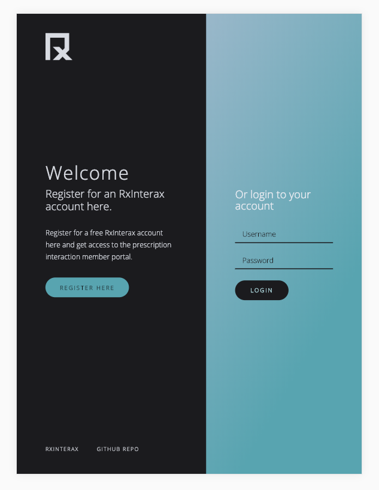
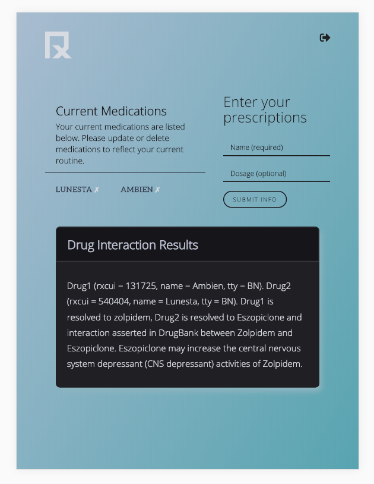

<h1 align="center"><strong>RxInterax</strong></h1>

## Overview

RxInterax is a full-stack, fully mobile responsive application that provides fast and accurate clinical prescription and OTC drug interactions to determine which drug combinations a user should be aware of or avoid. The app allows users to check new or potential medications against their saved current medications to find and identify potentially harmful and unsafe combinations. 

<h1 align="center"><strong>Take your health into your own hands. </strong></h1>

## Demo the App

*RxInterax* is deployed on Heroku. Demo the application [here](https://mysterious-fjord-70592.herokuapp.com/).

### Application Video Demo

## Installation

To install the application locally, run the following in your terminal/bash:

* git clone https://github.com/savannahcarr/rxinterax.git
* cd rxinterax
* npm install
* npm run start

Finally, open the local application on port 3000 at the following URL:  `localhost:3000`

## Technologies Implemented:

- Axios ~  https://www.npmjs.com/package/axios
- Bcrypt.js ~  https://www.npmjs.com/package/bcryptjs
- Body-parser ~  https://www.npmjs.com/package/body-parser
- Express ~  https://www.npmjs.com/package/express
- Express-session ~  https://www.npmjs.com/package/express-session
- MongoDB ~  https://www.npmjs.com/package/mongodb
- Mongoose ~  https://www.npmjs.com/package/mongoose
- Morgan ~  https://www.npmjs.com/package/morgan
- Node.js ~  https://www.npmjs.com/package/node
- Passport ~  https://www.npmjs.com/package/passport
- Passport-local ~  https://www.npmjs.com/package/passport-local
- React-router-dom ~  https://www.npmjs.com/package/react-router-dom
- Reactstrap ~  https://www.npmjs.com/package/reactstrap
- SweetAlert2 ~  https://www.npmjs.com/package/sweetalert2

## Built With

- This project was bootstrapped with [Create React App](https://github.com/facebook/create-react-app)
- Visual Studio Code ~ code editor
- Bootstrap ~ framework
- CSS ~ custom stylesheet

## Authors
- Alex Ichikawa [alex-ichikawa](https://github.com/alex-ichikawa)
- Savannah Carr [savannahcarr](https://github.com/savannahcarr)
- Charlene Rigby [CharleneRigby](https://github.com/CharleneRigby)
- Navreet Boparai [nboparai](https://github.com/nboparai)

## Credits

Full-Stack Flex Coding Bootcamp @ UCLA Extension
